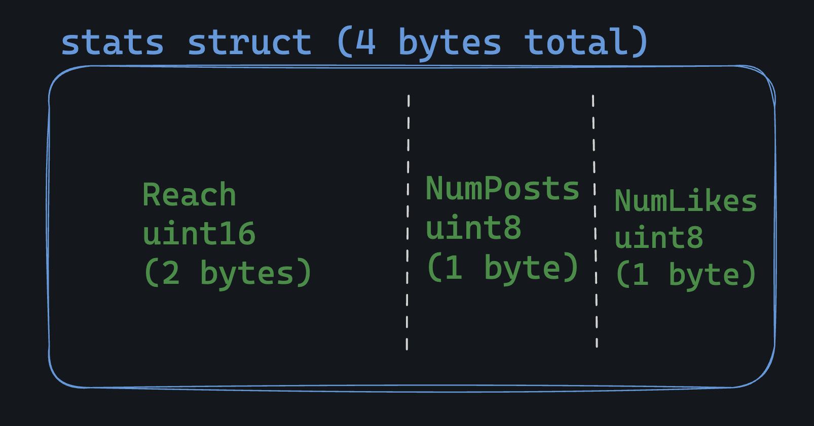
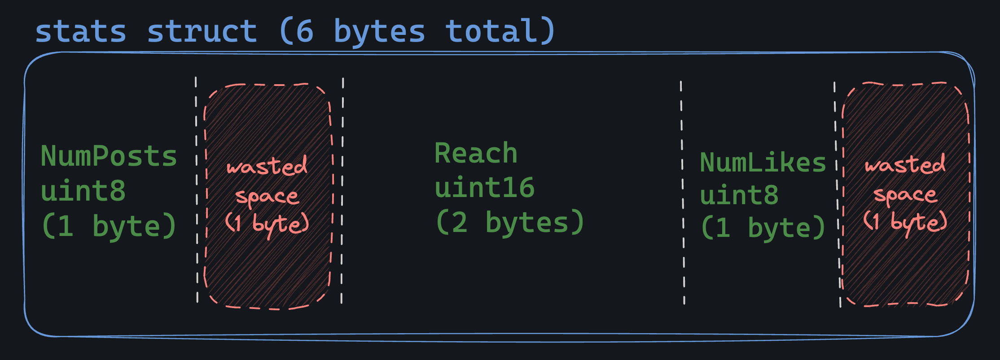

# Memory Layout

In Go, structs sit in memory in a contiguous block, with fields placed one after another as defined in the struct.

For example this struct:

```go
type stats struct {
	Reach    uint16
	NumPosts uint8
	NumLikes uint8
}
```

Looks like this in memory:



# Field ordering... matters?

the order of fields in a struct can have a big impact on memory usage.

This is the same struct as above, but poorly designed:

```go
type stats struct {
	NumPosts uint8
	Reach    uint16
	NumLikes uint8
}
```

It looks like this in memory:



Notice that Go has "aligned" the fields, meaning that it has added some padding (wasted space) to make up for the size difference between the uint16 and uint8 types.

- It's done for execution speed, but it can lead to increased memory usage.

# Should I panic?

To be honest, you should not stress about memory layout.

- However, if you have a specific reason to be concerned about memory usage, aligning the fields by size (largest to smallest) can help. You can also use the reflect package to debug the memory layout of a struct:

```go
typ := reflect.TypeOf(stats{})
fmt.Printf("Struct is %d bytes\n", typ.Size())
```

# Real story

I once had a server in production that held a lot of structs in memory. Like hundreds of thousands in a list.
When I re-ordered the fields in the struct, the memory usage of the program dropped by over 2 gigabytes!

It was a huge performance win.

# Assignment

Our over-engineering boss is at it again.

- He's heard about memory layout and wants to squeeze every last byte out of our structs.

Run the tests to see the current size of the structs, then update the struct definitions to minimize memory usage.
