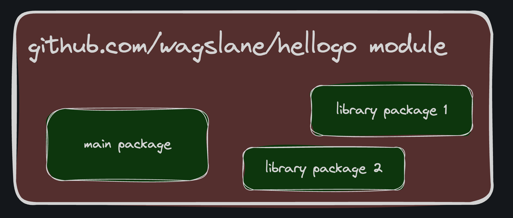

# Modules

Go programs are organized into packages.

- A package is a directory of Go code that's all compiled together.

- Functions, types, variables, and constants defined in one source file are visible to all other source files within the same package (directory).

- A repository contains one or more modules.

A module is a collection of Go packages that are released together.



## One module per repo (usually)

A file named `go.mod` at the root of a project declares the module. It contains:

- The module path
- The version of the Go language your project requires
- Optionally, any external package dependencies your project has

The module path is just the import path prefix for all packages within the module.

Here's an example of a `go.mod` file:

```go
module github.com/bootdotdev/exampleproject

go 1.23.0

require github.com/google/examplepackage v1.3.0
```

Each module's path not only serves as an import path prefix for the packages within but also indicates where the go command should look to download it.

For example, to download the module `golang.org/x/tools`,

- the go command would consult the repository located at [https://golang.org/x/tools](https://golang.org/x/tools).

> An "import path" is a string used to import a package.
> A package's import path is its module path joined with its subdirectory within the module.
>
> For example, the module github.com/google/go-cmp contains a package in the directory cmp/.
>
> - That package's import path is github.com/google/go-cmp/cmp.
>
> Packages in the standard library do not have a module path prefix.

-- Paraphrased from [Golang.org's code organization](https://golang.org/doc/code#Organization)

## Only GitHub?

You don't _need_ to publish your code to a remote repository before you can build it.

- A module can be defined locally without belonging to a remote repository.
- However, it's a good habit to keep a copy of all your projects on some remote server, like GitHub.
