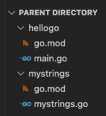

# Custom Package

Let's write a package to import and use in hellogo.

# Assignment

1. Create a sibling directory in the parent directory of the hellogo directory:

```bash
cd ..
mkdir mystrings
cd mystrings
```

2. Initialize a module:

```bash
go mod init {REMOTE}/{USERNAME}/mystrings
```

3. Create a new file `mystrings.go` in that directory and paste the following code:

```go

// by convention, we name our package the same as the directory
package mystrings

// Reverse reverses a string left to right
// Notice that we need to capitalize the first letter of the function
// If we don't then we won't be able to access this function outside of the
// mystrings package
func Reverse(s string) string {
  result := ""
  for _, v := range s {
    result = string(v) + result
  }
  return result
}
```



4. Notice there is no `main.go` or `func main()` in this package.
5. Run `go build` . Because this isn't a `main` package, it won't build an executable.
   - However, `go build` will still compile the package and save it to our local build cache. It's useful for checking for compile errors.
6. Run and submit the CLI tests from the root of the `mystrings` package.

## Run the CLI commands to test your solution.

1. cat go.mod
   - Expecting exit code: 0
   - Expecting stdout to contain all of:
     - mystrings
2. cat mystrings.go
   - Expecting exit code: 0
   - Expecting stdout to contain all of:
     - func Reverse(s string) string {
3. go build
   - Expecting exit code: 0
