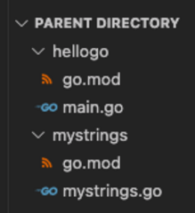

# Custom Package Continued

Let's use our new mystrings package in hellogo.

# Assignment

1. Modify hellogo's `main.go` file with the below code.
   - Don't forget to replace {REMOTE} and {USERNAME} with the values you used before.

```go
package main

import (
	"fmt"

	"{REMOTE}/{USERNAME}/mystrings"
)

func main() {
	fmt.Println(mystrings.Reverse("hello world"))
}
```

2. Edit hellogo's `go.mod` file to contain the following to import the local version of the `mystrings` dependency:

```bash
module example.com/username/hellogo

go 1.23.0

replace example.com/username/mystrings v0.0.0 => ../mystrings

require (
	example.com/username/mystrings v0.0.0
)
```



_Note: `../mystrings` tells `go` to look in the parent directory of `hellogo` for the `mystrings` sibling directory._

3. Build and run the new program:

```bash
go build
./hellogo
```

4. Run and submit the CLI tests from the root of the `main` package.

## Run the CLI commands to test your solution.

1. `./hellogo`
   - Expecting exit code: `0`
   - Expecting stdout to contain all of:
     - `dlrow olleh`
