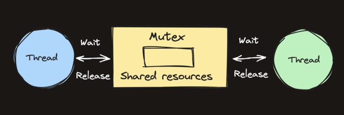

# Mutex Review

The principle problem that mutexes help us avoid is the concurrent read/write problem.

- This problem arises when one thread is writing to a variable while another thread is reading from that same variable at the same time.

When this happens, a Go program will panic because the reader could be reading bad data while it's being mutated in place.



## Mutex example

```go
package main

import (
	"fmt"
)

func main() {
	m := map[int]int{}
	go writeLoop(m)
	go readLoop(m)

	// stop program from exiting, must be killed
	block := make(chan struct{})
	<-block
}

func writeLoop(m map[int]int) {
	for {
		for i := 0; i < 100; i++ {
			m[i] = i
		}
	}
}

func readLoop(m map[int]int) {
	for {
		for k, v := range m {
			fmt.Println(k, "-", v)
		}
	}
}
```

The example above creates a map, then starts two goroutines which each have access to the map.

One goroutine continuously mutates the values stored in the map,

- while the other prints the values it finds in the map.

If we run the program on a multi-core machine, we get the following output:

- `fatal error: concurrent map iteration and map write`

In Go, it isn’t safe to read from and write to a map at the same time.

## Mutexes to the rescue

```go
package main

import (
	"fmt"
	"sync"
)

func main() {
	m := map[int]int{}

	mu := &sync.Mutex{}

	go writeLoop(m, mu)
	go readLoop(m, mu)

	// stop program from exiting, must be killed
	block := make(chan struct{})
	<-block
}

func writeLoop(m map[int]int, mu *sync.Mutex) {
	for {
		for i := 0; i < 100; i++ {
			mu.Lock()
			m[i] = i
			mu.Unlock()
		}
	}
}

func readLoop(m map[int]int, mu *sync.Mutex) {
	for {
		mu.Lock()
		for k, v := range m {
			fmt.Println(k, "-", v)
		}
		mu.Unlock()
	}
}
```

In this example, we added a `sync.Mutex{}` and named it `mu`.

In the write loop, the `Lock()` method is called before writing,

- and then the `Unlock()` is called when we're done.

This Lock/Unlock sequence ensures that no other threads can `Lock()` the mutex while we have it locked

- any other threads attempting to `Lock()` will block and wait until we `Unlock()`.

In the reader, we `Lock()` before iterating over the map, and likewise `Unlock()` when we're done.

Now the threads share the memory safely!
