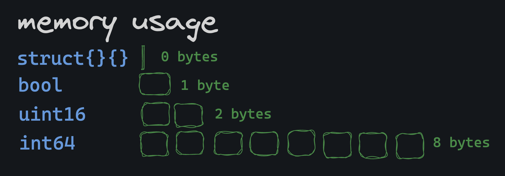

# Empty Struct

Empty structs are used in Go as a unary value.

```go
// anonymous empty struct type
empty := struct{}{}

// named empty struct type
type emptyStruct struct{}
empty := emptyStruct{}
```

The cool thing about empty structs is that they're the smallest possible type in Go:

- they take up **zero bytes of memory**.



Later in this course, you'll see how and when they're used: it's surprisingly often!

Mostly with maps and channels.
